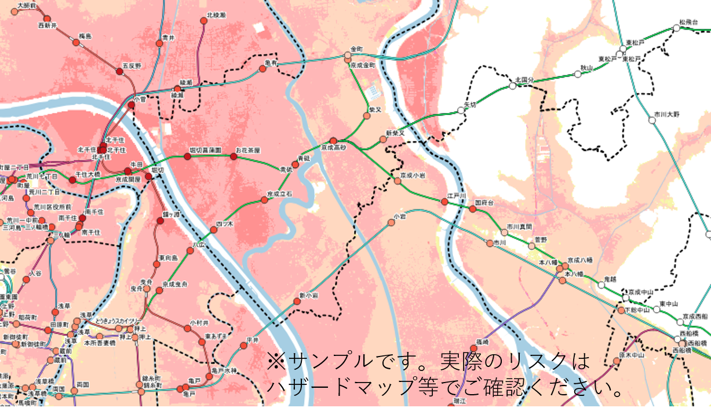
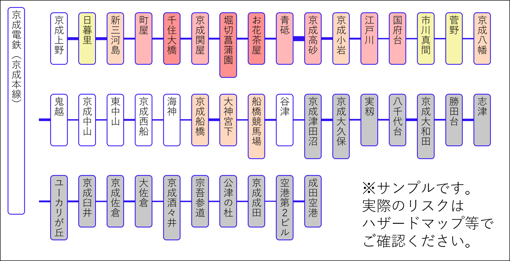

# railway-station-with-flood-info
鉄道駅と浸水想定図の関係を可視化

**鉄道駅の代表点が、浸水想定図でどの程度の浸水深となるかをざっくり把握するものです。利用の際は自己責任でお願いします** 

### デモサイト
※洪水浸水想定区域（想定最大規模）
* Web 地図で見る：https://mghs15.github.io/railway-station-with-flood-info/
* 路線図（スライド形式）：https://mghs15.github.io/railway-station-with-flood-info/slides/

※洪水浸水想定区域（想定最大規模）、高潮浸水想定区域、津波浸水想定
* 路線図（スライド形式、複数ハザード）：https://mghs15.github.io/railway-station-with-flood-info/slides/index2.html

### QGIS や Microsoft PowerPoint での表示例
※洪水浸水想定区域（想定最大規模）




※上記地図画像の作成には、下記のデータの他、地理院地図Vector のデータを利用。 

## 使い方

* `main.js`: 駅のデータ（国土数値情報の GeoJSON ）から、代表点を抽出し、ハザードマップポータルサイトの浸水想定図のライスタイルから浸水深さを取得するツール。**ハザードマップポータルサイトの API を叩くため、サーバ側の負荷とならないようにご注意ください。**
* `mkGsimapsMarker.js`: 地理院地図で表示できるようにスタイルを調整するツール。
* `lineup.js`: 得られた結果を路線図のような形で見られるように、pptx の構成ファイルへ変換するツール。

最初だけ、以下の通り。
```
npm install
```

データは、`data` ディレクトリを作成して格納。
必要なのは、以下の通り。
* 国土数値情報　鉄道データのうち、`N02-22_Station.geojson`（UTF-8。ファイル名は令和4年度の場合）。
* 第12回大都市交通センサス調査結果集計表（路線別着時間帯別駅間輸送定員表）を加工（ヘッダー削除、5列名に1日の定員合計を算出等、数値のコンマを削除、CSV変換、首都圏・中京圏・近畿圏のデータを結合）したもの。`railway-capacitycsv` として入れることを想定したコードになっている。

一式作成は以下の通り。
```
node main.js
cp result.json stations-kozui-l2-v2.json
node mkGsimapsMarker.js
mkdir pptx-slides
node lineup.js
```
生成したデータは公開用フォルダ `docs` へ格納。
* `resultLineupStations.json`：`docs/slides`
* `stations-kozui-l2-v2.json`：`docs` 直下

その他、`pptx-slides` 内に、スライド用 XML （PresentationML 形式）が生成される。

`stations-kozui-l2-with-gsistyle.geojson` は地理院地図やハザードマップで表示できるようにスタイルを調整したもの。

また、各災害の毎の `resultLineupStations.json` を作成した場合、それぞれ適宜名前を変更（例えば、`resultLineupStationsKozui.json`、`resultLineupStationsTakashio.json`、`resultLineupStationsTsunami.json` 等）し、以下のコマンドで統合版 `resultLineupStationsIntegrated.json` を作成できる。

```
node integrate.js
```
`resultLineupStationsIntegrated.json` は、`docs/slides` へ格納し、複数ハザードの路線図(`docs/index2.html`) で利用する。

## 利用したデータ
* 国土数値情報　鉄道データ 令和4年度
	* https://nlftp.mlit.go.jp/ksj/gml/datalist/KsjTmplt-N02-v3_1.html
	* UTF8 版の GeoJSON 利用
* 第12回大都市交通センサス調査結果集計表
	* https://www.mlit.go.jp/sogoseisaku/transport/sosei_transport_tk_000035.html
	* 路線別着時間帯別駅間輸送定員表 を加工（ヘッダー削除、CSV変換）
* 重ねるハザードマップ
	* https://disaportal.gsi.go.jp/hazardmap/copyright/opendata.html
	* 洪水浸水想定区域（想定最大規模）、高潮浸水想定区域、津波浸水想定

## 参考文献
* http://officeopenxml.com/drwSp-nvCxnSpPr.php
